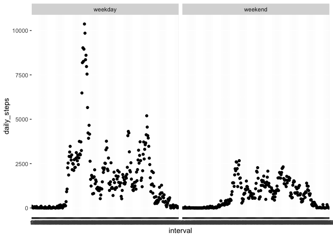

## Loading and preprocessing the data

We first load the Tidyverse package, import our data, and tidy it up for use in the project.


```r
# Load Tidyverse
library(tidyverse)
```

```
## ── Attaching packages ───────────────────────────────────────────────────── tidyverse 1.3.0 ──
```

```
## ✓ ggplot2 3.2.1     ✓ purrr   0.3.3
## ✓ tibble  2.1.3     ✓ dplyr   0.8.4
## ✓ tidyr   1.0.2     ✓ stringr 1.4.0
## ✓ readr   1.3.1     ✓ forcats 0.4.0
```

```
## ── Conflicts ──────────────────────────────────────────────────────── tidyverse_conflicts() ──
## x dplyr::filter() masks stats::filter()
## x dplyr::lag()    masks stats::lag()
```

```r
# Unzip and load data into a table

if (!file.exists("activity.csv")) { unzip("activity.zip", exdir = ".") }
data <- read.csv("activity.csv")
data <- tbl_df(data)

# Convert date variable to date class
data$date <- as.Date(data$date, "%Y-%m-%d")

# Convert daily interval variable to factor class
data$interval <- as.factor(data$interval)
```

## What is mean total number of steps taken per day?

The mean total number of steps taken per day is 9354.23. The median is 10395.

To determine the mean total number of steps taken per day, we first group the data by date. Then we calcualte the total number of steps taken per day. Per the assignment, we created a histogram to view the grouped data before finding the exact mean and median.


```r
# Group data by date
data2 <- group_by(data, date)

# Calculate total number of steps taken per day
data2 <- summarize(data2, daily_steps = sum(steps, na.rm=T))

# Make a histogram of total number of steps taken each day
hist(data2$daily_steps, breaks=20)
```

<!-- -->

```r
# Calculate mean and median of total number of steps taken per day
mean(data2$daily_steps, na.rm=T)
```

```
## [1] 9354.23
```

```r
median(data2$daily_steps, na.rm=T)
```

```
## [1] 10395
```

## What is the average daily activity pattern?

The 5-minute interval beginning at 8:35 has the highest number of steps.


```r
# Group data by daily interval
data3 <- group_by(data, interval)

# Calculate mean steps by daily interval across all dates
data3 <- summarize(data3, avg_steps = mean(steps, na.rm=T))

# Plot mean steps (y axis) by daily interval (x axis) across all dates
plot(data3$interval, data3$avg_steps)
lines(data3$interval, data3$avg_steps)
```

<!-- -->

```r
# Find 5-minute interval with max average number of daily steps
filter(data3, avg_steps == max(data3$avg_steps))
```

```
## # A tibble: 1 x 2
##   interval avg_steps
##   <fct>        <dbl>
## 1 835           206.
```

## Imputing missing values

The total number of missing values in the dataset is 2304.

The strategy for filling in missing values is to use the daily average of the interval.

The mean number of steps taken per day is 10766.19. The median is 10766.19.

These values are higher than the values calculated without imputing missing values.


```r
# Calculate total number of rows with NAs
sum(is.na(data$steps))
```

```
## [1] 2304
```

```r
# Join datasets so interval average is observed alongside interval observation
data4 <- left_join(data3, data)
```

```
## Joining, by = "interval"
```

```r
# Create new variable that uses interval average where steps is NA
data4 <- mutate(data4, steps2 = ifelse(is.na(steps), avg_steps, steps))

# Convert to numeric
data4$steps <- as.numeric(data4$steps2)

# Remove extraneous columns
data4 <- select(data4, steps, date, interval)

# Group data by day and calculate total steps per day
data4_grouped <- group_by(data4, date)
data4_grouped <- summarize(data4_grouped, daily_steps = sum(steps))

# Make a histogram of the total number of steps taken each day 
hist(data4_grouped$daily_steps, breaks=20)
```

<!-- -->

```r
# Calculate mean and median of total number of steps taken per day
mean(data4_grouped$daily_steps)
```

```
## [1] 10766.19
```

```r
median(data4_grouped$daily_steps)
```

```
## [1] 10766.19
```

## Are there differences in activity patterns between weekdays and weekends?

Activity levels appear to be higher on weekdays than on the weekend.


```r
# Create a new factor variable with two levels – “weekday” and “weekend”

data5 <- mutate(data4, weekday = weekdays(date))

data5 <- mutate(data5, weekday = ifelse(
  weekday %in% c("Saturday","Sunday"),
  "weekend",
  "weekday"))

data5$weekday <- as.factor(data5$weekday)

data5_grouped <- group_by(data5, weekday, interval)
data5_grouped <- summarize(data5_grouped, daily_steps = sum(steps))

# Make a panel plot comparing 5-minute interval averages by weekday vs. weekend

ggplot(data5_grouped, aes(interval, daily_steps)) + geom_point() + facet_wrap(~weekday)
```

<!-- -->
